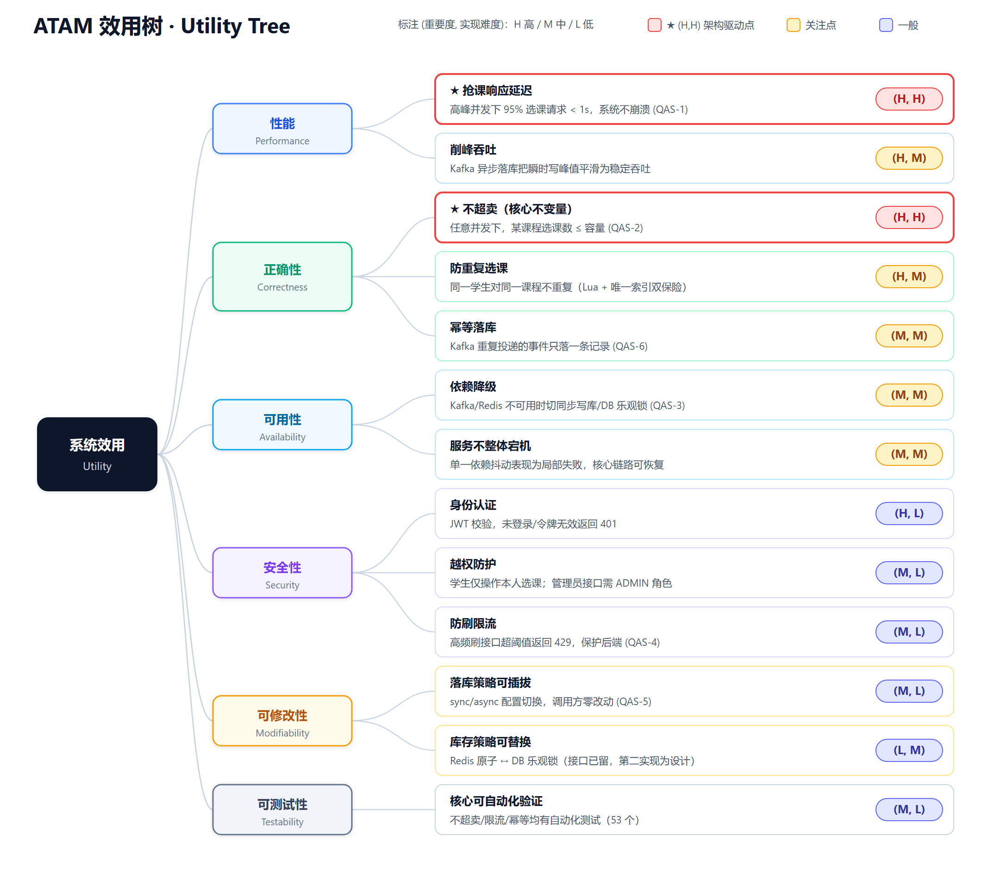

# 高校抢课系统 —— ATAM 效用树（Utility Tree）

> 对应课程任务 T4。效用树是 ATAM 评估的起点：把抽象的"质量需求"逐层细化为**可度量、可排序的质量属性场景（叶子）**，
> 并对每个叶子标注 **(重要度, 实现难度)**，从而识别出真正驱动架构的关键点。

## 一、读法

- **结构**：根（系统效用 Utility）→ 质量属性（性能/正确性/可用性/安全性/可修改性/可测试性）→ 质量属性场景（叶子）。
- **标注 (重要度, 实现难度)**：H 高 / M 中 / L 低。
  - **第一维 重要度**：该场景对系统成败有多关键。
  - **第二维 实现难度/风险**：达成它的技术难度与风险有多大。
- **★ (H,H) = 架构驱动点**：既最重要又最难，是架构设计和 ATAM 分析必须重点关注、优先验证的地方。

## 二、叶子清单（按优先级）

| 质量属性 | 质量属性场景（叶子） | 优先级 | 对应场景/实现 |
|---|---|---|---|
| 性能 | ★ 抢课响应延迟：高峰 95% 请求 < 1s，不崩溃 | **(H, H)** | QAS-1；Redis 原子扣减 + Kafka 削峰 |
| 性能 | 削峰吞吐：异步落库保持稳定吞吐 | (H, M) | Kafka 缓冲 |
| 正确性 | ★ 不超卖（核心不变量）：并发下选课数 ≤ 容量 | **(H, H)** | QAS-2；`try_enroll.lua` + 唯一索引 |
| 正确性 | 防重复选课 | (H, M) | Redis 已选集合 + 唯一索引 |
| 正确性 | 幂等落库：重复事件只落一次 | (M, M) | QAS-6；exists 判断 + 唯一索引 |
| 可用性 | 依赖降级：Kafka/Redis 不可用时切换 | (M, M) | QAS-3；persist-mode / DB 乐观锁 |
| 可用性 | 服务不整体宕机 | (M, M) | 局部失败、可恢复 |
| 安全性 | 身份认证（JWT） | (H, L) | JwtAuthFilter |
| 安全性 | 越权防护（本人/管理员） | (M, L) | Authz |
| 安全性 | 防刷限流（429） | (M, L) | QAS-4；rate_limit.lua |
| 可修改性 | 落库策略可插拔（sync/async） | (M, L) | QAS-5；EnrollmentPersister |
| 可修改性 | 库存策略可替换（设计） | (L, M) | InventoryStrategy 接口预留 |
| 可测试性 | 核心可自动化验证 | (M, L) | 53 个测试 |

## 三、两个架构驱动点 (H,H)

1. **抢课响应延迟**：决定用户体验与系统存活，靠"Redis 原子扣减（快路径）+ Kafka 异步落库（削峰）"达成。
2. **不超卖**：业务正确性的底线，靠"单条 Lua 脚本原子完成防重+扣减 + 数据库唯一索引兜底"达成。

> 这两个点同时**最重要**且**最具挑战**，因此成为后续 ATAM 分析（敏感点 / 权衡点 / 风险点）的聚焦对象。

## 四、向后衔接 ATAM（简述）

效用树确定优先级后，针对高优先级叶子分析架构决策，得到：

- **敏感点**：库存扣减放 Redis 还是 DB；Kafka `acks`/offset 提交时机；限流阈值。
- **权衡点（TP1）**：Redis 原子 + Kafka 异步 → 性能↑可用性↑，但一致性退化为**最终一致**。
- **有风险决策**：Redis 单点、Kafka 消息重复/丢失、缓存与 DB 对账不及时。
- **无风险决策**：模块化单体、唯一索引兜底、JWT 无状态鉴权。

（完整 ATAM 评估见架构设计文档第四章。）
