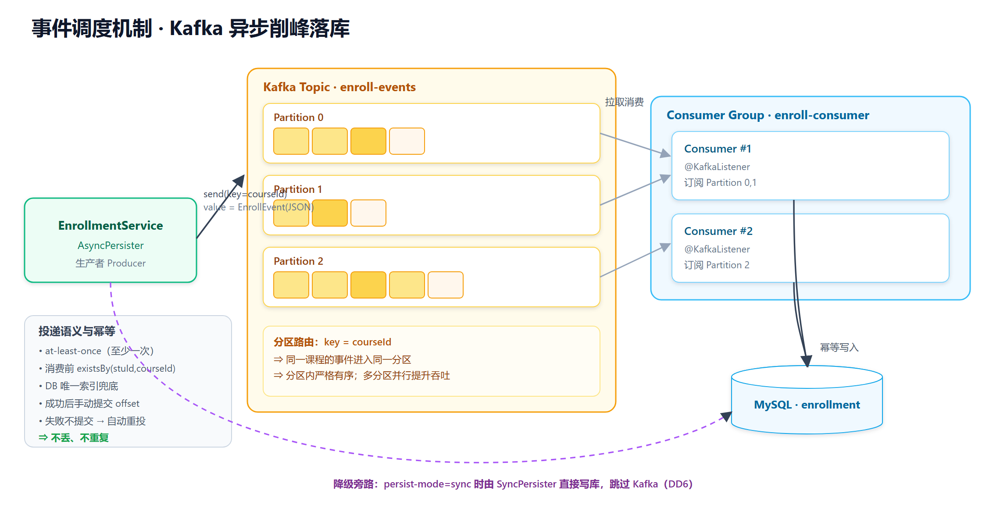
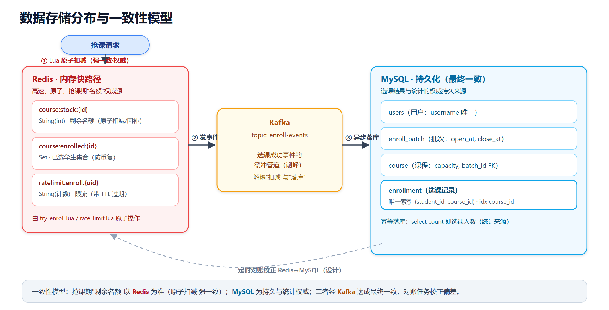

# 高校抢课系统 —— 事件调度机制 与 数据库设计

> 依据**实际代码**（`course-rush/`）整理。配图位于 `diagrams/`，每张提供 SVG/PNG/PDF 三格式。

---

# 一、事件调度机制（Kafka 异步削峰）

## 1.1 为什么用事件驱动

抢课的本质是**瞬时洪峰**：开放一刻大量"选课成功"需要落库。若同步写库，数据库瞬时写压力极大、响应变慢甚至被打垮。
因此系统把**"扣减名额"与"持久化落库"解耦**：

- 扣减在 **Redis**（快、原子、决定成败）——同步完成；
- 落库通过 **Kafka** 异步进行——消费者按稳定速率消费，把峰值"削平"。

这就是"削峰填谷"：Kafka 作为缓冲水库先接住洪峰，DB 平稳写入。



## 1.2 核心组件（对应代码）

| 组件 | 角色 | 代码 |
|---|---|---|
| 生产者 Producer | 抢课成功后发事件 | `EnrollEventProducer`（`KafkaTemplate`） |
| 主题 Topic | `enroll-events` | 配置 `app.enroll.topic` |
| 分区 Partition | 按 `key=courseId` 路由 | `kafkaTemplate.send(topic, courseId, event)` |
| 消费者组 Consumer Group | `enroll-consumer` 并行消费 | `EnrollEventConsumer`（`@KafkaListener`） |
| 落库策略 | 同步/异步可切换 | `EnrollmentPersister`（Sync/Async） |

## 1.3 事件结构

```java
public record EnrollEvent(Long studentId, Long courseId, long createdAtEpochMs) {}
```
- 序列化：`JsonSerializer` / `JsonDeserializer`（消费端配置可信包与默认类型）。
- **幂等键**：`(studentId, courseId)`——天然唯一，无需额外消息 ID。

## 1.4 分区与顺序性

- 以 **`courseId` 作为分区 key** ⇒ 同一门课的所有事件落入**同一分区**，分区内**严格有序**；
- 不同课程分散到不同分区，**多分区 + 消费者组并行**提升整体吞吐；
- 这样既保证"单课程事件有序处理"，又获得横向扩展能力。

## 1.5 投递语义与幂等（不丢、不重复）

系统采用 **at-least-once（至少一次）** + **消费幂等**：

1. **不丢**：消费者**处理成功后才手动提交 offset**（`ack-mode=manual`，`ack.acknowledge()`）；若处理中失败、不提交 offset，Kafka 会重新投递。
2. **不重复**：消费时先 `existsByStudentIdAndCourseId(...)` 判断，再写库；并以数据库**唯一索引 `(student_id, course_id)`** 兜底，重复消息被忽略。

```java
@KafkaListener(topics = "${app.enroll.topic}", groupId = "${spring.kafka.consumer.group-id}")
@Transactional
public void onMessage(EnrollEvent event, Acknowledgment ack) {
    persistIdempotent(event);   // exists 判断 + 唯一索引兜底
    ack.acknowledge();          // 成功后再提交 offset
}
```

> 已用测试 `AsyncEnrollmentIT.duplicateEventIsPersistedOnlyOnce` 验证：同一事件投递两次，最终只落一条记录。

## 1.6 失败处理与补偿

| 场景 | 处理 |
|---|---|
| 消费写库异常 | 不提交 offset → Kafka 重投 → 幂等保证最终落库一次 |
| 同步模式写库唯一冲突 | `SyncEnrollmentPersister` 捕获 `DataIntegrityViolationException` → **回补 Redis 名额** → 返回 409 |
| 退课 | 删除记录 + `RedisStockService.rollback`（回补名额、移出已选集合） |
| 对账（设计中）| 定时任务比对 Redis 库存与 MySQL 选课数，校正偏差 |

## 1.7 降级开关（DD6 / 可修改性 DD5）

`app.enroll.persist-mode` 一处配置切换落库策略：

| 取值 | 行为 | 适用 |
|---|---|---|
| `async`（默认）| 发 Kafka，消费者异步落库，返回 **PENDING** | 高并发生产环境（削峰） |
| `sync` | `SyncPersister` 直接写库，返回 **ENROLLED** | Kafka 不可用时降级 / 强一致演示 |

> 体现两点课程知识：**可修改性**（策略可插拔，调用方零改动）、**可用性降级**（依赖不可用时退化而非停服）。

## 1.8 抢课成功后的事件时序（简述）

`Redis 原子扣减成功 → 构造 EnrollEvent → Producer.send(key=courseId) → 立即返回 PENDING`
`→ Consumer 拉取 → 幂等写入 enrollment → 提交 offset`。
（完整时序见 `diagrams/03_抢课时序图`。）

---

# 二、数据库设计

## 2.1 存储职责划分

系统数据分布在三处，各司其职：



| 存储 | 存什么 | 定位 |
|---|---|---|
| **Redis** | `course:stock:{id}`(剩余名额)、`course:enrolled:{id}`(已选Set)、`ratelimit:enroll:{uid}` | 抢课期**快路径 / 名额权威**，原子操作 |
| **Kafka** | `enroll-events` 事件 | 落库的**缓冲管道**（削峰、解耦） |
| **MySQL** | users / enroll_batch / course / enrollment | **持久化与统计的权威来源** |

## 2.2 表结构（DDL）

> 与 JPA 实体一致（`spring.jpa.hibernate.ddl-auto` 自动建表，下为等价 DDL）。

```sql
-- 用户（学生 / 管理员）
CREATE TABLE users (
    id            BIGINT       NOT NULL AUTO_INCREMENT,
    username      VARCHAR(64)  NOT NULL,
    name          VARCHAR(64)  NOT NULL,
    password_hash VARCHAR(100) NOT NULL,           -- BCrypt
    role          VARCHAR(16)  NOT NULL,           -- STUDENT / ADMIN
    PRIMARY KEY (id),
    UNIQUE KEY uk_username (username)
);

-- 抢课批次（开放时间窗口）
CREATE TABLE enroll_batch (
    id       BIGINT      NOT NULL AUTO_INCREMENT,
    name     VARCHAR(64) NOT NULL,
    open_at  DATETIME(6) NOT NULL,
    close_at DATETIME(6) NOT NULL,
    PRIMARY KEY (id)
);

-- 课程（含容量上限，归属批次）
CREATE TABLE course (
    id        BIGINT       NOT NULL AUTO_INCREMENT,
    name      VARCHAR(100) NOT NULL,
    teacher   VARCHAR(64)  NOT NULL,
    time_slot VARCHAR(64),
    capacity  INT          NOT NULL,               -- 容量上限
    batch_id  BIGINT       NOT NULL,               -- 逻辑外键 -> enroll_batch.id
    PRIMARY KEY (id)
);

-- 选课记录
CREATE TABLE enrollment (
    id         BIGINT      NOT NULL AUTO_INCREMENT,
    student_id BIGINT      NOT NULL,               -- 逻辑外键 -> users.id
    course_id  BIGINT      NOT NULL,               -- 逻辑外键 -> course.id
    status     VARCHAR(16) NOT NULL,               -- ENROLLED / CANCELLED
    created_at DATETIME(6) NOT NULL,
    PRIMARY KEY (id),
    UNIQUE KEY uk_student_course (student_id, course_id),  -- 防重复选课兜底
    KEY idx_course (course_id)                              -- 按课程统计加速
);
```

字段类型对照 JPA 实体：`User / EnrollBatch / Course / Enrollment`（`Instant` ↦ `DATETIME(6)`，枚举以 `STRING` 存储）。

## 2.3 关系与 ER 图

逻辑关系（一对多）：

- `enroll_batch (1) —— (N) course`（`course.batch_id`）
- `course (1) —— (N) enrollment`（`enrollment.course_id`）
- `users (1) —— (N) enrollment`（`enrollment.student_id`）

详见 `diagrams/04_ER图`。

## 2.4 索引设计

| 表 | 索引 | 作用 |
|---|---|---|
| users | `uk_username` 唯一 | 登录按用户名查；保证用户名唯一 |
| enrollment | `uk_student_course` 唯一 | **防重复选课的最终防线**（即便 Redis 失效也不会重复） |
| enrollment | `idx_course` | `countByCourseId` 选课统计加速 |

## 2.5 不设数据库外键约束（设计决策）

`batch_id / student_id / course_id` 均为**普通列（逻辑外键）**，**未建 DB 外键约束**：

- **原因**：高并发写入下外键会带来额外的约束检查与锁竞争，影响吞吐；
- **完整性如何保证**：在**应用层**校验（如发布课程时校验批次存在 `BatchService.getById`），并以**唯一索引**兜底关键不变量（不重复选课）。

这是一个典型的"用一致性换性能"的取舍点，可写入 ATAM 的权衡分析。

## 2.6 库存的双写与一致性

| 阶段 | 库存以谁为准 | 说明 |
|---|---|---|
| 抢课开放期 | **Redis**（`course:stock`） | Lua 原子扣减，强一致、防超卖；MySQL 落库滞后 |
| 落库完成后 | MySQL `enrollment` 计数 | `select count(*)` 即真实选课人数，统计权威 |
| 退课 | 删 `enrollment` + Redis `rollback` | 回补名额、移出已选集合 |
| 对账（设计中） | 定时校正 | 比对 Redis 剩余名额 与 `capacity - count(enrollment)` |

**一致性模型**：抢课期"还有没有名额"以 Redis 为准（强一致原子扣减）；MySQL 为持久与统计权威；二者经 Kafka 达成**最终一致**。这对应 ATAM 中"性能/可用性 ↔ 一致性"的核心权衡点（TP1）。

## 2.7 预热（Preheat）

抢课开放前，管理员触发 `POST /api/admin/courses/{id}/preheat`：把 `course.capacity` 写入 `course:stock:{id}`。
之后所有扣减只打 Redis，避免抢课瞬间穿透到数据库读容量。`EnrollmentService` 亦内置 `preheatIfAbsent` 兜底（首个请求若未预热则按容量自动初始化）。

---

## 附：相关图片（`diagrams/`）
| 文件 | 内容 |
|---|---|
| 05_事件调度机制 | Kafka 生产者/分区/消费者组/幂等/降级 |
| 06_数据存储分布 | Redis / Kafka / MySQL 职责与一致性流 |
| 04_ER图 | 数据模型实体关系 |
| 03_抢课时序图 | 含事件发送与异步落库的完整时序 |
