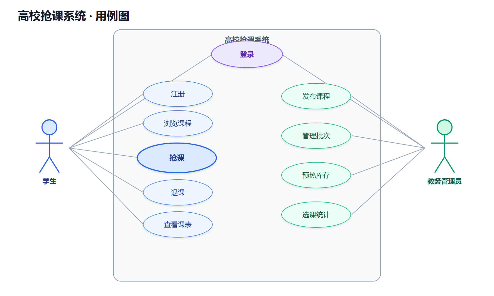
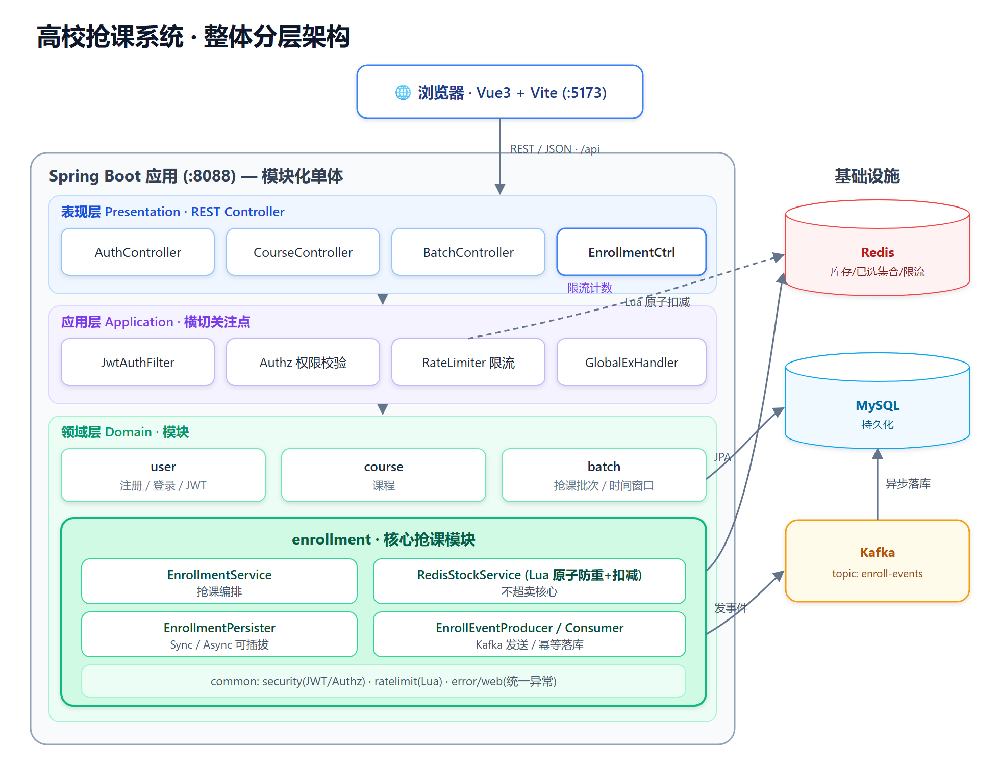
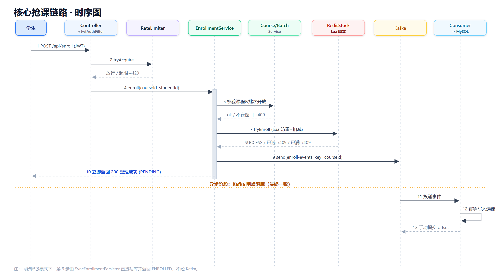
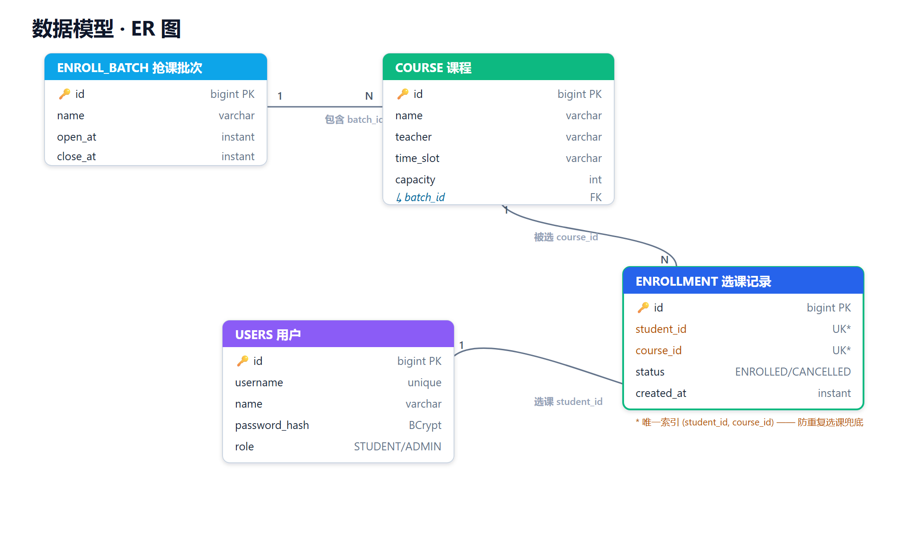

# 高校抢课系统 —— 需求分析与架构设计

> 本文依据**实际实现的代码**（`course-rush/`）整理，对应课程任务 T1（需求）、T2（需求分析方法）、T3（架构设计）。
> 配图位于 `diagrams/` 目录，每张图提供 **SVG（矢量）/ PNG（2×高清）/ PDF（矢量）** 三种格式，可直接插入报告。

---

# 一、功能性需求分析

## 1.1 系统角色

| 角色 | 说明 | 代码体现 |
|---|---|---|
| 学生 (STUDENT) | 浏览课程、抢课、退课、查看个人课表 | `Role.STUDENT` |
| 教务管理员 (ADMIN) | 发布课程、管理抢课批次、预热库存、查看选课统计 | `Role.ADMIN` |
| 系统 | 在抢课时间窗口内承接高并发选课，保证不超卖与可用 | `EnrollmentService` 等 |

## 1.2 功能性需求列表

| 编号 | 功能 | 角色 | 实际接口 | 说明 |
|---|---|---|---|---|
| FR-1 | 用户注册 | 学生/管理员 | `POST /api/auth/register` | 用户名唯一，密码 BCrypt 哈希 |
| FR-2 | 用户登录 | 学生/管理员 | `POST /api/auth/login` | 校验密码，签发 JWT |
| FR-3 | 浏览课程列表 | 所有人 | `GET /api/courses` | 课程名/教师/时间/容量 |
| FR-4 | 查看课程详情 | 所有人 | `GET /api/courses/{id}` | 单门课程信息 |
| FR-5 | 发布课程 | 管理员 | `POST /api/courses` | 设容量、归属批次；校验批次存在、容量>0 |
| FR-6 | 查看抢课批次 | 所有人 | `GET /api/batches` | 批次及其开放/关闭时间 |
| FR-7 | 创建抢课批次 | 管理员 | `POST /api/batches` | 设定开放时间窗口 [openAt, closeAt) |
| FR-8 | 库存预热 | 管理员 | `POST /api/admin/courses/{id}/preheat` | 抢课前把容量加载进 Redis |
| **FR-9** | **抢课（选课）** | 学生 | `POST /api/enroll` | **核心高并发**；防重、防超卖、限流 |
| FR-10 | 退课 | 学生 | `DELETE /api/enroll/{courseId}` | 释放名额（回补 Redis 库存） |
| FR-11 | 查看个人课表 | 学生 | `GET /api/my/enrollments` | 我已选课程列表 |
| FR-12 | 选课统计 | 管理员 | `GET /api/admin/courses/{id}/stats` | 已选 / 容量 / 剩余 |

## 1.3 用例图

## 1.4 核心用例规约：UC 抢课

| 项 | 内容 |
|---|---|
| 用例名 | 抢课（选课） |
| 主角 | 学生 |
| 前置条件 | 已登录（持有效 JWT）；课程所属批次处于开放时间窗口内；该课程库存已预热 |
| 主成功场景 | 1. 学生提交抢课请求 `POST /api/enroll {courseId}` 2. 系统校验 JWT 身份 3. 系统对该用户做限流校验 4. 系统校验课程存在且批次开放 5. 系统执行 Redis Lua 原子脚本：判断未重复选课且仍有名额 → 扣减库存、记录已选 6. 系统发"选课成功"事件到 Kafka 7. 立即返回"受理成功(处理中)"，消费者异步把选课记录写入数据库 |
| 扩展/异常流 | 3a. 超过限流阈值 → 429「操作过于频繁」 4a. 不在抢课时间窗口 → 400 5a. 已选过该课程 → 409 5b. 名额已抢完 → 409 2a. 未登录/令牌无效 → 401 |
| 后置条件 | 成功时：Redis 剩余名额−1，最终数据库新增一条选课记录（总数永不超过容量） |

---

# 二、非功能性需求分析

采用**质量属性场景**（六元组：刺激源 / 刺激 / 制品 / 环境 / 响应 / 响应度量）描述，并对应到实际实现与验证方式。

## 2.1 质量属性总览

| 编号 | 质量属性 | 需求概述 | 实现手段 |
|---|---|---|---|
| NFR-1 | 性能 Performance | 抢课峰值下快速响应、不崩溃 | Redis Lua 原子扣减（避开 DB 行锁）+ Kafka 异步落库削峰 |
| NFR-2 | 正确性 Correctness | 任意并发下不超卖、不重复选课 | Lua 原子"防重+扣减" + 数据库唯一索引兜底 |
| NFR-3 | 可用性 Availability | 依赖抖动时降级而非整体宕机 | 落库模式 sync/async 可切换；退课/失败回补 |
| NFR-4 | 安全性 Security | 身份认证、越权防护、防刷 | JWT + BCrypt + 接口限流 |
| NFR-5 | 可修改性 Modifiability | 关键策略可替换且不影响调用方 | `EnrollmentPersister` 策略接口（同步/异步两实现）|
| NFR-6 | 可测试性 Testability | 核心质量属性可自动化验证 | 53 个测试；Testcontainers/EmbeddedKafka |

## 2.2 质量属性场景（详细）

| 编号 | 质量属性 | 刺激源 | 刺激 | 制品 | 环境 | 响应 | 响应度量 | 实际验证 |
|---|---|---|---|---|---|---|---|---|
| QAS-1 | 性能 | 大量学生 | 开放瞬间并发提交选课 | 选课服务 | 抢课高峰 | 受理并快速返回 | 高并发不崩溃、吞吐稳定 | 压测：300并发→189 req/s，P95≈1.5s |
| QAS-2 | 正确性 | 并发学生 | 对仅剩少量名额课程同时抢 | 库存扣减模块 | 高并发 | 仅容量内的人成功 | 最终选课数==容量，超卖=0 | 单测+压测：20容量/200并发→恰好20；50/300→恰好50 |
| QAS-3 | 可用性 | 依赖(Kafka) | 异步通道不可用 | 落库策略 | 抢课期 | 切换为同步写库 | 改 1 处配置即恢复，不停服 | `persist-mode=sync` |
| QAS-4 | 安全性 | 恶意用户 | 脚本高频刷抢课接口 | 限流器 | 抢课期 | 超阈值请求被拒 | 返回 429，后端不被打垮 | `RateLimiterTest`+`EnrollRateLimitIT` |
| QAS-5 | 可修改性 | 开发者 | 更换落库实现 | 落库策略接口 | 开发期 | 替换实现类 | 调用方零改动 | Sync/AsyncEnrollmentPersister |
| QAS-6 | 正确性(幂等) | Kafka | 同一事件重复投递 | 消费者 | 异步落库 | 仅落库一次 | 重复消息不产生重复记录 | `AsyncEnrollmentIT.duplicateEvent...` |

## 2.3 关键非功能实现说明

- **不超卖（NFR-2）**：核心在 `try_enroll.lua`——单条 Lua 脚本内原子完成"判断是否已选 → 判断库存 → 扣减 → 记录已选"，Redis 单线程执行保证原子性，从根上杜绝并发超卖；数据库 `(student_id, course_id)` 唯一索引为第二道防线。
- **削峰填谷（NFR-1）**：抢课成功只做一次 Redis 操作并发一条 Kafka 消息即返回，写库由消费者按稳定速率异步完成，瞬时写压力被 Kafka 缓冲。
- **限流（NFR-4）**：`rate_limit.lua` 以"用户+固定时间窗口"计数（INCR+EXPIRE），超阈值返回 429。

---

# 三、整体架构设计

## 3.1 架构风格
**分层架构 (Layered) + 事件驱动 (Event-Driven, Kafka 削峰) + 客户端-服务器 (B/S)**，工程上打包为**模块化单体 (Modular Monolith)**。

## 3.2 整体分层架构图

## 3.3 核心抢课链路时序图

> 同步降级模式下，"发事件→消费者落库"这一段由 `SyncEnrollmentPersister` 直接写库并返回 `ENROLLED` 替代，不经 Kafka。

## 3.4 数据模型 (ER 图)

## 3.5 模块与关键类

| 模块(包) | 职责 | 关键类 |
|---|---|---|
| `user` | 注册/登录/身份 | AuthService, User, UserRepository, AuthController |
| `course` | 课程 | CourseService, Course, CourseController |
| `batch` | 抢课批次/时间窗口 | BatchService, EnrollBatch, BatchController |
| `enrollment` | **核心抢课** | EnrollmentService, **RedisStockService(Lua)**, EnrollmentPersister(Sync/Async), mq.EnrollEventProducer/Consumer |
| `common.security` | 认证授权 | JwtService, JwtAuthFilter, Authz, CurrentUserContext |
| `common.ratelimit` | 限流 | RateLimiter(Lua) |
| `common.error/web` | 统一异常 | GlobalExceptionHandler, ApiError |

## 3.6 Redis 键设计

| 键 | 类型 | 用途 |
|---|---|---|
| `course:stock:{courseId}` | String(int) | 课程剩余名额（原子扣减） |
| `course:enrolled:{courseId}` | Set | 已选学生集合（防重复） |
| `ratelimit:enroll:{userId}` | String(计数) | 抢课限流计数（带过期） |

## 3.7 技术栈

| 层 | 技术 |
|---|---|
| 前端 | Vue 3 + Vite |
| 后端 | Java 17 + Spring Boot 3.5（Web / Data JPA / Data Redis / Kafka） |
| 存储/中间件 | MySQL 8、Redis 7、Kafka(KRaft) |
| 鉴权 | JWT (jjwt) + BCrypt |
| 测试 | JUnit5 + H2 + Testcontainers + @EmbeddedKafka |

---

## 附：图片资源清单（`diagrams/`）
| 文件 | 内容 | 格式 |
|---|---|---|
| 01_用例图 | 功能性需求用例图 | .svg / .png / .pdf |
| 02_架构分层图 | 整体分层架构 | .svg / .png / .pdf |
| 03_抢课时序图 | 核心抢课链路时序 | .svg / .png / .pdf |
| 04_ER图 | 数据模型 ER | .svg / .png / .pdf |
