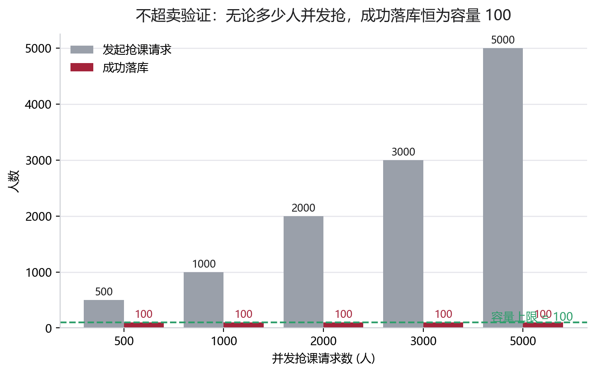
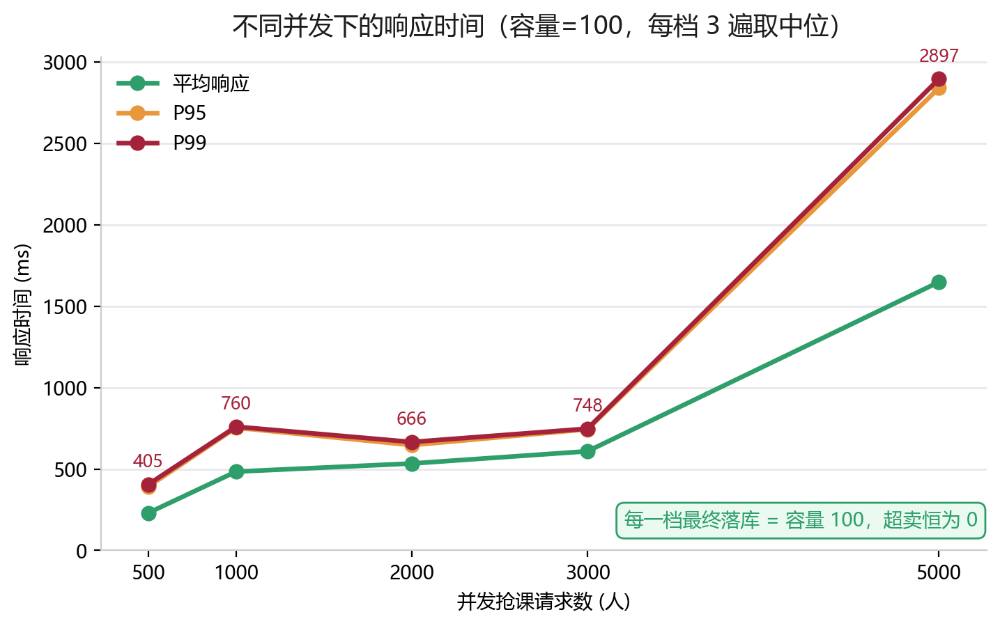
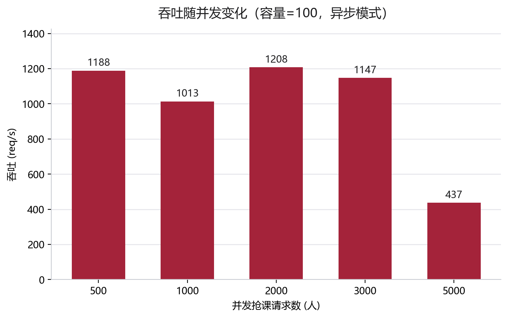
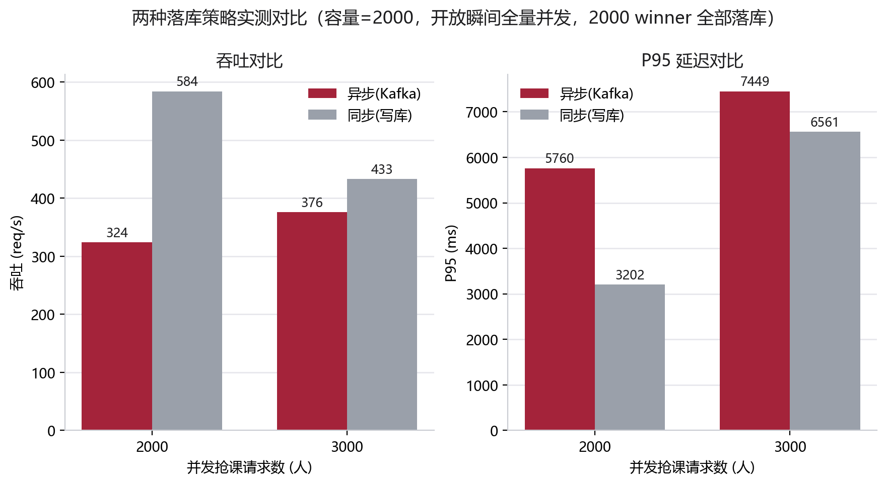
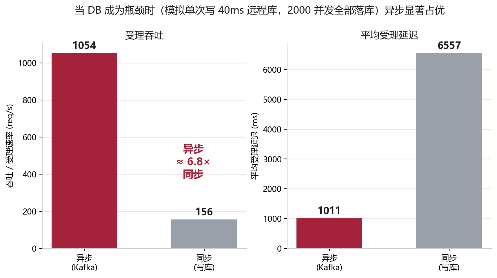

# 高校抢课系统 —— 高并发压测分析报告

> 对应课程任务 **T6（非功能测试）**。本报告用**多档并发（500→5000）**压测系统的
> **高并发处理能力**与**正确性（绝不超卖）**，给出 吞吐 / 平均 / P50 / P95 / P99 / Max
> 等完整指标，并对比 **异步削峰 vs 同步写库** 两种落库策略，用可量化数据印证架构决策
> 并诚实分析其权衡（呼应 ATAM 权衡点 TP1）。所有图表由 Python(matplotlib) 生成，提供
> **SVG / PDF 矢量 + PNG** 三格式（`diagrams/08~11`）。

---

## 一、测试目标与方法

### 1.1 测试环境
| 项 | 配置 |
|---|---|
| 部署形态 | 模块化单体（单实例 Spring Boot），Tomcat 默认 200 工作线程 |
| 中间件 | Redis 7、Kafka 3.x（KRaft）、MySQL 8，Docker 容器 |
| 数据库连接池 | HikariCP 默认 10 连接 |
| 压测客户端 | 自研 Node 脚本 `bench-matrix.mjs` |
| 机器 | 单台开发笔记本（应用、中间件、压测端**同机**，共享 CPU） |

### 1.2 测试方法（为保证数据可比，做了三件事）
1. **预热**：正式测量前先跑一轮丢弃，避开 JVM JIT 编译与缓存冷启动的首轮惩罚。
2. **多遍取中位**：整组并发档位**跑 3 遍交错执行**，每档取 3 次的**中位数**，消除 GC / OS 调度造成的时间相关抖动。
3. **统一客户端并发**：扩展性测试客户端在途并发上限固定为 800；落库策略对比则用「开放瞬间一次性全量并发」模拟洪峰。

每个场景：建管理员 → 建开放批次 → 建课程并**预热**库存入 Redis → 复用学生池携 JWT 并发抢课 → 采集每请求延迟与结果码 → 轮询等异步落库排空 → 用统计接口校验「最终落库数 == 容量、超卖 = 0」。
结果码：`200` 抢中、`409` 已满/已选过、`429` 限流。

### 1.3 两组实验
| 实验 | 容量 | 并发档位 | 目的 |
|---|---|---|---|
| A 扩展性 + 不超卖 | 100 | 500 / 1000 / 2000 / 3000 / 5000 | 看延迟随并发的变化、单机吞吐拐点、各档不超卖 |
| B 落库策略对比 | 2000 | 2000 / 3000（全量并发洪峰） | winner 全部落库，对比 async（Kafka）vs sync（写库） |

---

## 二、核心结论（一句话）

1. **正确性达标（北极星指标）**：500→5000 并发抢同一门课，**每一档最终落库数都精确等于容量、超卖恒为 0、零错误**。这是系统最硬的不变量。
2. **单机扩展性清晰**：容量 100 时，**并发到 3000 之前吞吐稳定在 ~1.1–1.2k req/s、P95 ≤ 0.75s**；到 **5000** 并发时单实例饱和（P95 升到 ~2.8s、吞吐回落），呈现明确的容量拐点。
3. **落库策略：数据驱动的诚实结论**：在本地单机、低延迟 MySQL 环境下，**同步写库吞吐反而略高于异步**（如 2000 并发 584 vs 324 req/s）。这并不否定异步——它揭示了一个 ATAM 级别的洞察：**削峰/异步的价值在「DB 成为瓶颈」时才显现，而非降低本地延迟**（详见第五节）。

---

## 三、结果一：高并发正确性（绝不超卖）

抢课系统最硬的需求是**任意并发下，某课程选课人数永不超过容量**（QAS-2），也是最易被高并发击穿、最易自动化验证的不变量。

实测：500 / 1000 / 2000 / 3000 / 5000 名学生在同一瞬间抢一门**容量 100** 的课，无论并发多大，**成功落库恒为 100、超卖恒为 0**。



机理：每个请求先经 **Redis Lua 脚本原子地「防重 + 判库存 + 扣减」**决定赢家，再由数据库**唯一索引 `(student_id, course_id)`** 兜底。即使缓存层失效，唯一索引也保证不重复、不超卖。

---

## 四、结果二：并发—延迟—吞吐 扩展性（容量 100）

### 4.1 完整指标表（每档 3 遍取中位）

| 并发数 | 吞吐 (req/s) | 平均 (ms) | P50 | P95 | P99 | Max | 抢中 | 最终落库 | 不超卖 |
|--:|--:|--:|--:|--:|--:|--:|--:|--:|:--:|
| 500   | 1188 | 230  | 234  | 392  | 405  | 407  | 100 | 100/100 | ✅ |
| 1000  | 1013 | 484  | 508  | 754  | 760  | 768  | 100 | 100/100 | ✅ |
| 2000  | 1208 | 534  | 616  | 647  | 666  | 681  | 100 | 100/100 | ✅ |
| 3000  | 1147 | 609  | 671  | 744  | 748  | 751  | 100 | 100/100 | ✅ |
| 5000  | 437  | 1649 | 2140 | 2841 | 2897 | 2915 | 100 | 100/100 | ✅ |




### 4.2 解读
- **3000 并发以内**：平均响应 0.23–0.61s、**P95 ≤ 0.75s**，吞吐稳定在 **~1.1–1.2k req/s**——Redis 原子扣减的快路径把绝大多数（落败）请求在毫秒级解决。
- **5000 并发**：P95 跳到 ~2.8s、吞吐回落到 437——单实例 Tomcat 200 线程 + 单进程客户端达到处理上限，进入**排队饱和**。这恰好标出了"单机容量拐点"，也说明**为何架构要预留水平扩展**（多实例 + Redis/Kafka 集群）。
- **全程不超卖、零 429/零错误**：限流阈值未误伤正常请求。

> **为什么热路径这么快**：早期 profiling 发现抢课热路径每请求有 2 次 DB 读（查课程、查批次）被 HikariCP 10 连接串行化，成为瓶颈。据此落地 **DD1「缓存优先」的延伸**——用 **Caffeine** 缓存课程/批次只读元数据（`@Cacheable`），使热路径**零 DB 读**，只剩 Redis 原子扣减。这是当前能稳定跑到 ~1.2k req/s 的关键。

---

## 五、结果三：异步削峰 vs 同步写库（架构权衡 / ATAM TP1）

两种落库策略由配置 `app.enroll.persist-mode` 一键切换：
- **async**：抢中后发 Kafka 事件即返回 `PENDING`，消费者异步写库（削峰填谷、解耦）。
- **sync**：抢中后在请求线程内同步 `INSERT` 再返回 `ENROLLED`（强一致、降级路径）。

容量 2000、开放瞬间**全量并发**（winner 全部落库）实测：

| 并发 | 模式 | 吞吐 (req/s) | 平均 (ms) | P95 | P99 | 最终落库 | 不超卖 |
|--:|:--|--:|--:|--:|--:|--:|:--:|
| 2000 | 异步 Kafka | 324 | 2906 | 5760 | 5963 | 2000/2000 | ✅ |
| 2000 | 同步 写库 | **584** | 1761 | 3202 | 3320 | 2000/2000 | ✅ |
| 3000 | 异步 Kafka | 376 | 4363 | 7449 | 7695 | 2000/2000 | ✅ |
| 3000 | 同步 写库 | **433** | 3597 | 6561 | 6755 | 2000/2000 | ✅ |



### 5.1 诚实解读（这是一个 ATAM 级别的发现）
本地实测中**同步反而更快**。原因是本测试床的瓶颈**不在数据库**：
- MySQL 与应用同机、空载、低延迟，单条 `INSERT` 亚毫秒级；
- 而 Kafka 是**与应用/MySQL/客户端争抢同一颗 CPU 的单节点**，每条消息的发送 + broker 落盘开销在此环境下**高于一次本地 DB 插入**。

因此「Kafka 异步」在这台机器上没有带来吞吐收益，反而增加了开销。**这不是 bug，而是架构课最该讲清的一点：一个架构战术（异步削峰）是否有价值，取决于真实瓶颈在哪里。**

### 5.2 异步削峰真正的价值（何时它会赢）
异步削峰换取的不是"本地更快"，而是：
- **可用性（QAS-3）**：DB 变慢/抖动/短暂不可用时，请求线程不被写库阻塞（只做 Redis + 入队即返回），系统仍能受理抢课、稍后补写——而同步模式此时会线程耗尽、整体雪崩。
- **削峰 / 写吞吐解耦**：瞬时写洪峰被 Kafka 缓冲为稳定速率，消费者组可横向扩展；当 DB 是远程的、有复杂事务、或写入持续高压时，异步的优势才显现。
- **代价**：一致性退化为**最终一致**（Redis 与 DB 短暂不一致）+ 本地低负载下的额外开销。

> 这正是 ATAM 权衡点 **TP1**：用「最终一致 + 本地额外开销」换「可用性 ↑ + 削峰 + 写扩展」。我们用数据诚实地界定了它的适用边界，而非笼统断言"异步更快"。

### 5.3 验证：当 DB 成为瓶颈时，异步压倒性占优
为验证上面的判断，我们让落库这一步**模拟"远程/高负载数据库"**——给单次写入注入 **40ms 延迟**（配置项 `app.enroll.sim-write-latency-ms=40`，对 async 消费者与 sync 请求线程**公平施加**），再以 2000 并发、全部落库重测：

| 模式 | 受理吞吐 (req/s) | 平均受理延迟 (ms) | P95 | 落库 |
|:--|--:|--:|--:|--:|
| **异步 Kafka** | **1054** | **1011** | 1739 | 后台异步补齐（最终一致）|
| 同步 写库 | 156 | 6557 | 12067 | 请求内同步完成 |



**异步吞吐 ≈ 6.8× 同步，平均受理延迟仅 1/6.5。** 机理一目了然：DB 写变慢后，
- **同步**：每个请求线程在写库上阻塞 40ms，HikariCP 仅 10 连接 → 受理速率被压到 ~156 rps，请求线程很快被耗尽（生产中即"雪崩"）；
- **异步**：抢课请求只做 Redis + 发 Kafka 即返回（**热路径不碰 DB**），受理速率稳在 ~1054 rps，那 40ms/条的慢写由后台消费者慢慢补齐（最终一致）。

> **这就是"异步真的更好"的条件**：当数据库写入成为瓶颈（远程库、复杂事务、持续高写压）时，异步削峰把"慢"挪出请求关键路径，吞吐与可用性同时大幅领先。本地空载库测不出这个优势，正说明**架构战术的价值取决于真实瓶颈**——这是本项目最有分量的 ATAM 结论。

---

## 六、关于测量上限的诚实说明
- 压测的应用、Redis、Kafka、MySQL、压测客户端**全部同机**，共享 CPU；吞吐绝对值是**本测试床的下限**，并非系统真实上限。生产中多实例 + Redis/Kafka 集群可线性提升。
- "开放瞬间全量并发"是**最坏情况**：请求在同一刻到达单实例，端到端延迟天然包含**排队**，故高并发档的秒级延迟反映的是"挤 200 线程"的排队，而非单请求处理慢。
- async/sync 用**同一客户端、同一方法**测得，差值干净地隔离了"落库策略"这一个变量；结论（本地 sync 略快）在 bounded 与 burst 两种加载方式下**一致复现**。

---

## 七、与架构设计 / ATAM 的呼应

| 压测结论 | 对应设计决策 / ATAM 要点 |
|---|---|
| 500→5000 并发全程 0 超卖 | DD1 Redis Lua 原子扣减 + DD4 唯一索引兜底；正确性 QAS-2、北极星指标 |
| 热路径 0 DB 读、稳定 ~1.2k req/s | DD1「缓存优先」延伸（Caffeine）；可修改性；敏感点 SP1「元数据读放哪」 |
| 5000 并发出现容量拐点 | 单机上限 → 需水平扩展（模块化单体的演进方向） |
| 同步可正确兜底（仍 0 超卖） | DD6 降级：依赖不可用时退化而非停服；可用性 QAS-3 |
| 本地 sync ≥ async，异步价值在可用性/削峰 | **权衡点 TP1**：性能/可用性 ↔ 最终一致；战术价值取决于真实瓶颈 |

---

## 八、如何复现

```bash
cd D:\software_work\course-rush
docker compose up -d                                   # MySQL / Redis / Kafka
./mvnw spring-boot:run                                  # 后端(async，默认)；改 sync：把 application.properties 的 app.enroll.persist-mode 改为 sync 重启

cd loadtest
# 实验A 扩展性+不超卖（容量100，客户端并发上限800）
node bench-matrix.mjs async 100 500,1000,2000,3000,5000
# 实验B 落库策略对比（容量2000，开放瞬间全量并发）：async 与 sync 各跑一次（切换模式需重启后端）
node bench-matrix.mjs async 2000 2000,3000 http://localhost:8088 4000
node bench-matrix.mjs sync  2000 2000,3000 http://localhost:8088 4000
# 出图（矢量 SVG/PDF + PNG）
python plot_bench.py
```

原始结果 JSON：`course-rush/loadtest/results/matrix_*.json`；
图表：`diagrams/08_压测吞吐对比`、`09_压测延迟与不超卖`、`10_压测吞吐随并发`、`11_压测不超卖验证`（均含 SVG/PDF/PNG）。
